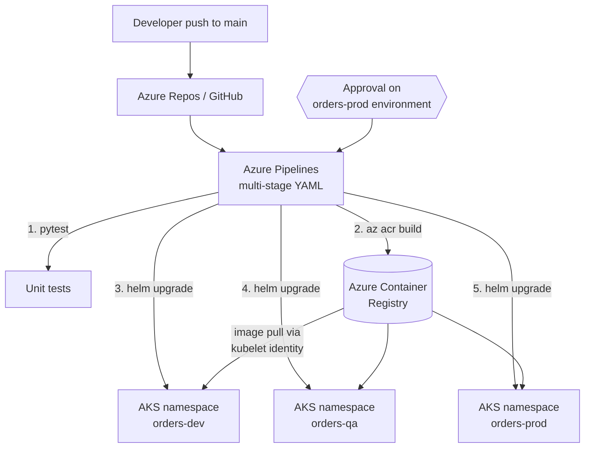
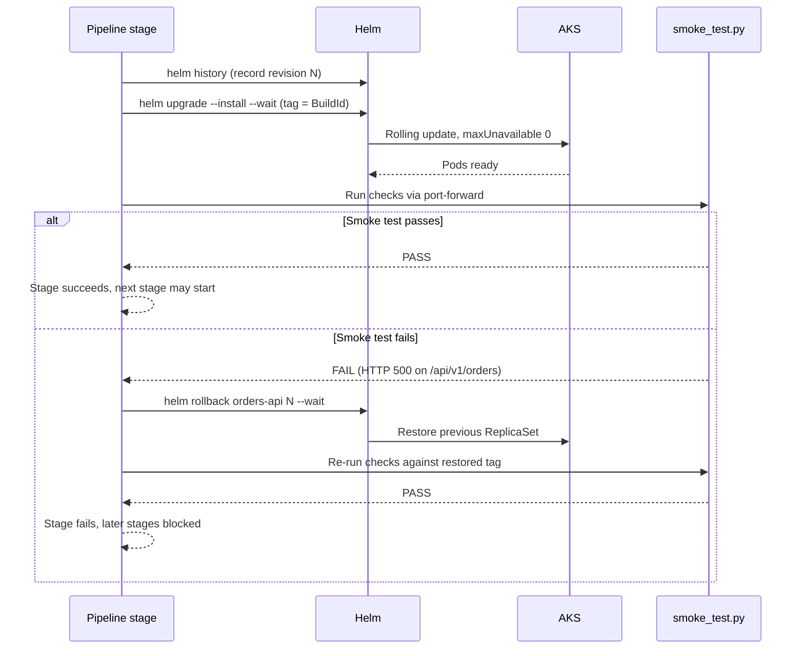

# Architecture: AKS Delivery Platform

## System view

```mermaid
flowchart TB
  dev[Developer push to main] --> repo[Azure Repos / GitHub]
  repo --> pipe[Azure Pipelines<br/>multi-stage YAML]
  pipe -->|1. pytest| test[Unit tests]
  pipe -->|2. az acr build| acr[(Azure Container<br/>Registry)]
  pipe -->|3. helm upgrade| aksdev[AKS namespace<br/>orders-dev]
  pipe -->|4. helm upgrade| aksqa[AKS namespace<br/>orders-qa]
  appr{{Approval on<br/>orders-prod environment}} --> pipe
  pipe -->|5. helm upgrade| aksprod[AKS namespace<br/>orders-prod]
  acr -->|image pull via<br/>kubelet identity| aksdev
  acr --> aksqa
  acr --> aksprod
```

## Deployment, smoke test and rollback sequence

```mermaid
sequenceDiagram
  participant P as Pipeline stage
  participant H as Helm
  participant K as AKS
  participant S as smoke_test.py
  P->>H: helm history (record revision N)
  P->>H: helm upgrade --install --wait (tag = BuildId)
  H->>K: Rolling update, maxUnavailable 0
  K-->>H: Pods ready
  P->>S: Run checks via port-forward
  alt Smoke test passes
    S-->>P: PASS
    P-->>P: Stage succeeds, next stage may start
  else Smoke test fails
    S-->>P: FAIL (HTTP 500 on /api/v1/orders)
    P->>H: helm rollback orders-api N --wait
    H->>K: Restore previous ReplicaSet
    P->>S: Re-run checks against restored tag
    S-->>P: PASS
    P-->>P: Stage fails, later stages blocked
  end
```
