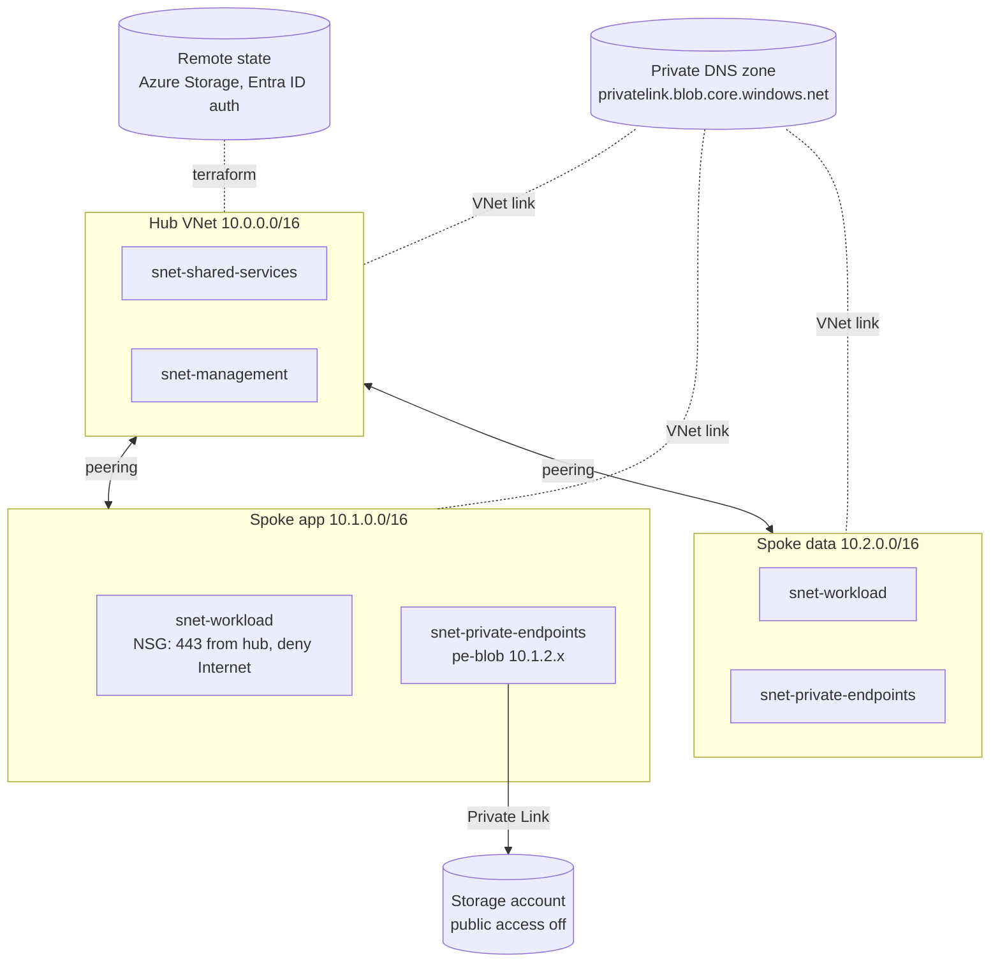
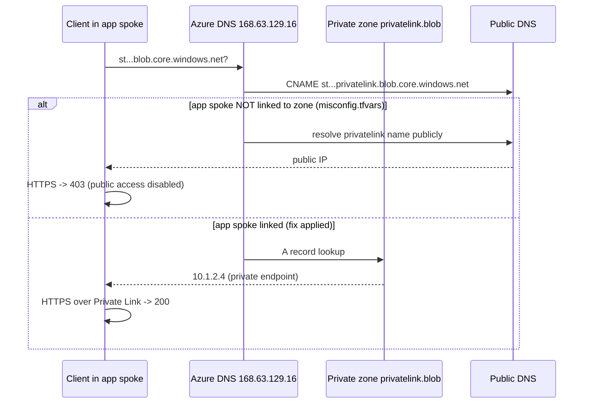

# Architecture: Azure Hub-and-Spoke with Terraform

## Network view

```mermaid
flowchart TB
  subgraph HUB[Hub VNet 10.0.0.0/16]
    shared[snet-shared-services]
    mgmt[snet-management]
  end
  subgraph APP[Spoke app 10.1.0.0/16]
    wl1[snet-workload<br/>NSG: 443 from hub, deny Internet]
    pe1[snet-private-endpoints<br/>pe-blob 10.1.2.x]
  end
  subgraph DATA[Spoke data 10.2.0.0/16]
    wl2[snet-workload]
    pe2[snet-private-endpoints]
  end
  HUB <-->|peering| APP
  HUB <-->|peering| DATA
  zone[(Private DNS zone<br/>privatelink.blob.core.windows.net)]
  zone -. VNet link .- HUB
  zone -. VNet link .- APP
  zone -. VNet link .- DATA
  pe1 -->|Private Link| st[(Storage account<br/>public access off)]
  state[(Remote state<br/>Azure Storage, Entra ID auth)] -. terraform .- HUB
```

## Name resolution: broken vs fixed

```mermaid
sequenceDiagram
  participant VM as Client in app spoke
  participant DNS as Azure DNS 168.63.129.16
  participant PZ as Private zone privatelink.blob
  participant PUB as Public DNS
  VM->>DNS: st...blob.core.windows.net?
  DNS->>PUB: CNAME st...privatelink.blob.core.windows.net
  alt app spoke NOT linked to zone (misconfig.tfvars)
    DNS->>PUB: resolve privatelink name publicly
    PUB-->>VM: public IP
    VM->>VM: HTTPS -> 403 (public access disabled)
  else app spoke linked (fix applied)
    DNS->>PZ: A record lookup
    PZ-->>VM: 10.1.2.4 (private endpoint)
    VM->>VM: HTTPS over Private Link -> 200
  end
```
