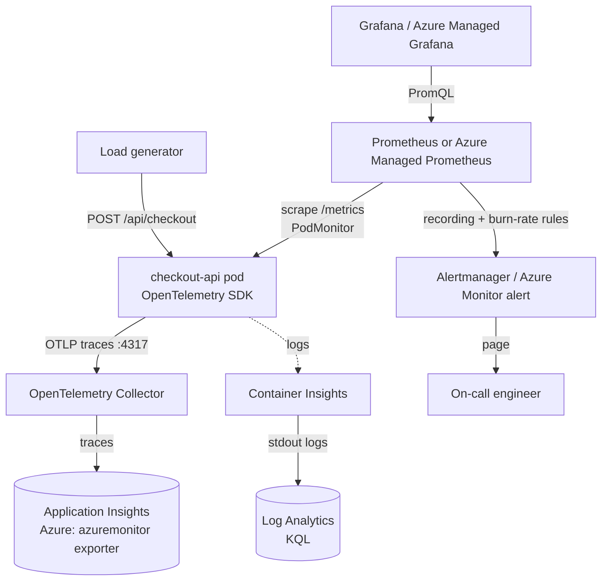
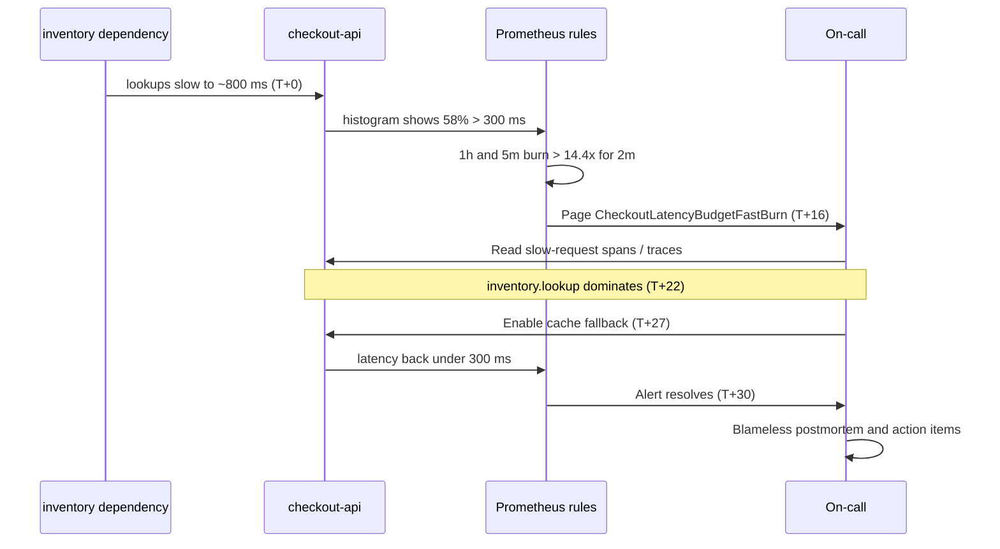

# Architecture: AKS Observability and SRE Incident Lab

## Telemetry flow

```mermaid
flowchart TB
  user[Load generator] -->|POST /api/checkout| svc[checkout-api pod<br/>OpenTelemetry SDK]
  svc -->|OTLP traces :4317| col[OpenTelemetry Collector]
  col -->|traces| ai[(Application Insights<br/>Azure: azuremonitor exporter)]
  prom[Prometheus or Azure Managed Prometheus] -->|scrape /metrics<br/>PodMonitor| svc
  prom -->|recording + burn-rate rules| am[Alertmanager / Azure Monitor alert]
  am -->|page| oncall[On-call engineer]
  graf[Grafana / Azure Managed Grafana] -->|PromQL| prom
  ci[Container Insights] -->|stdout logs| law[(Log Analytics<br/>KQL)]
  svc -. logs .-> ci
```

## Incident response sequence

```mermaid
sequenceDiagram
  participant Dep as inventory dependency
  participant Svc as checkout-api
  participant Prom as Prometheus rules
  participant OC as On-call
  Dep->>Svc: lookups slow to ~800 ms (T+0)
  Svc->>Prom: histogram shows 58% > 300 ms
  Prom->>Prom: 1h and 5m burn > 14.4x for 2m
  Prom->>OC: Page CheckoutLatencyBudgetFastBurn (T+16)
  OC->>Svc: Read slow-request spans / traces
  Note over OC,Svc: inventory.lookup dominates (T+22)
  OC->>Svc: Enable cache fallback (T+27)
  Svc->>Prom: latency back under 300 ms
  Prom->>OC: Alert resolves (T+30)
  OC->>OC: Blameless postmortem and action items
```
