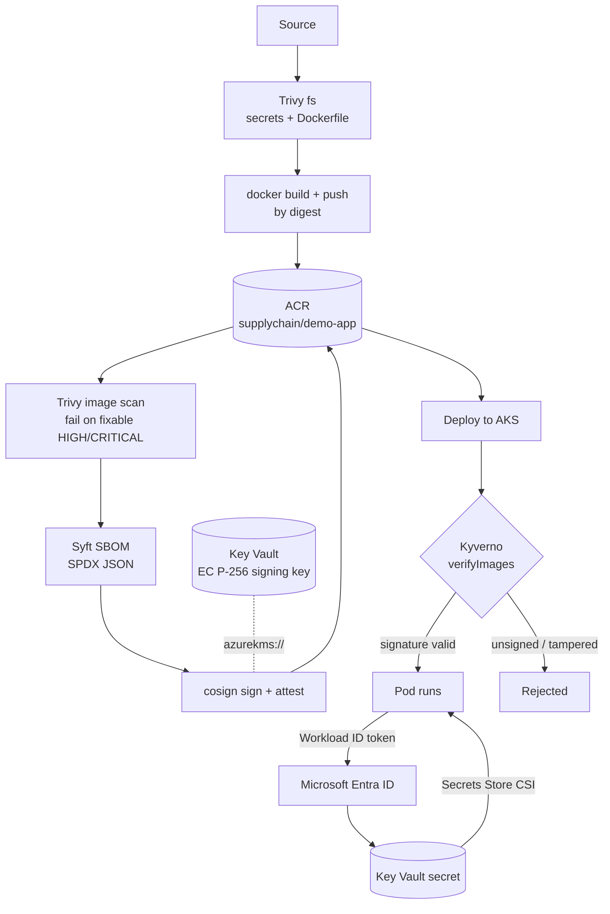
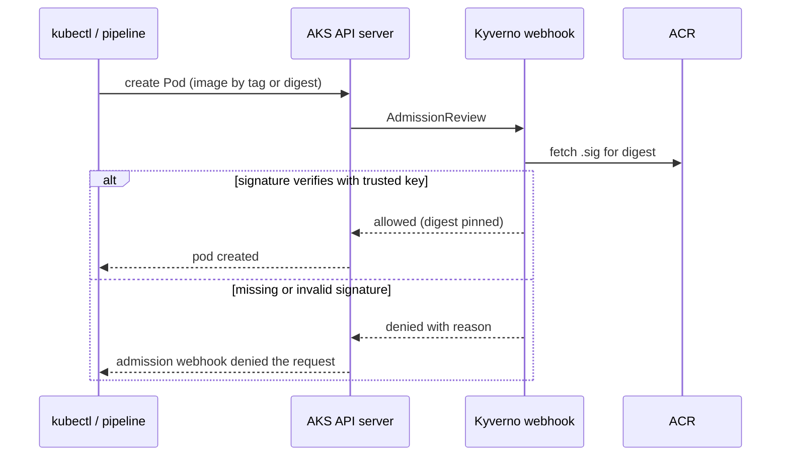

# Architecture: Azure DevSecOps Software Supply Chain

## Pipeline and runtime view

```mermaid
flowchart TB
  src[Source] --> s1[Trivy fs<br/>secrets + Dockerfile]
  s1 --> b[docker build + push<br/>by digest]
  b --> acr[(ACR<br/>supplychain/demo-app)]
  acr --> s2[Trivy image scan<br/>fail on fixable HIGH/CRITICAL]
  s2 --> sb[Syft SBOM<br/>SPDX JSON]
  sb --> sg[cosign sign + attest]
  kv[(Key Vault<br/>EC P-256 signing key)] -. azurekms:// .- sg
  sg --> acr
  acr --> dep[Deploy to AKS]
  dep --> kyv{Kyverno<br/>verifyImages}
  kyv -->|signature valid| pod[Pod runs]
  kyv -->|unsigned / tampered| deny[Rejected]
  pod -->|Workload ID token| entra[Microsoft Entra ID]
  entra --> kv2[(Key Vault secret)]
  kv2 -->|Secrets Store CSI| pod
```

## Admission sequence

```mermaid
sequenceDiagram
  participant K as kubectl / pipeline
  participant API as AKS API server
  participant KY as Kyverno webhook
  participant R as ACR
  K->>API: create Pod (image by tag or digest)
  API->>KY: AdmissionReview
  KY->>R: fetch .sig for digest
  alt signature verifies with trusted key
    KY-->>API: allowed (digest pinned)
    API-->>K: pod created
  else missing or invalid signature
    KY-->>API: denied with reason
    API-->>K: admission webhook denied the request
  end
```
