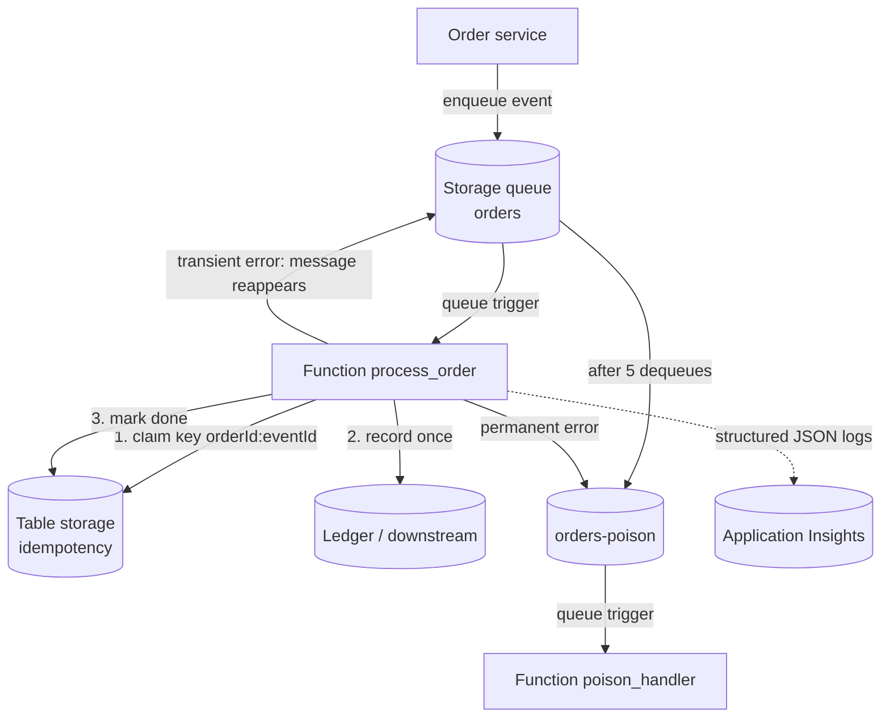

# Architecture: Azure Functions Event-Driven Processing

```mermaid
flowchart TB
  prod[Order service] -->|enqueue event| q[(Storage queue<br/>orders)]
  q -->|queue trigger| fn[Function process_order]
  fn -->|1. claim key orderId:eventId| t[(Table storage<br/>idempotency)]
  fn -->|2. record once| led[(Ledger / downstream)]
  fn -->|3. mark done| t
  fn -->|transient error: message reappears| q
  q -->|after 5 dequeues| pq[(orders-poison)]
  fn -->|permanent error| pq
  pq -->|queue trigger| ph[Function poison_handler]
  fn -. structured JSON logs .-> ai[(Application Insights)]
```
