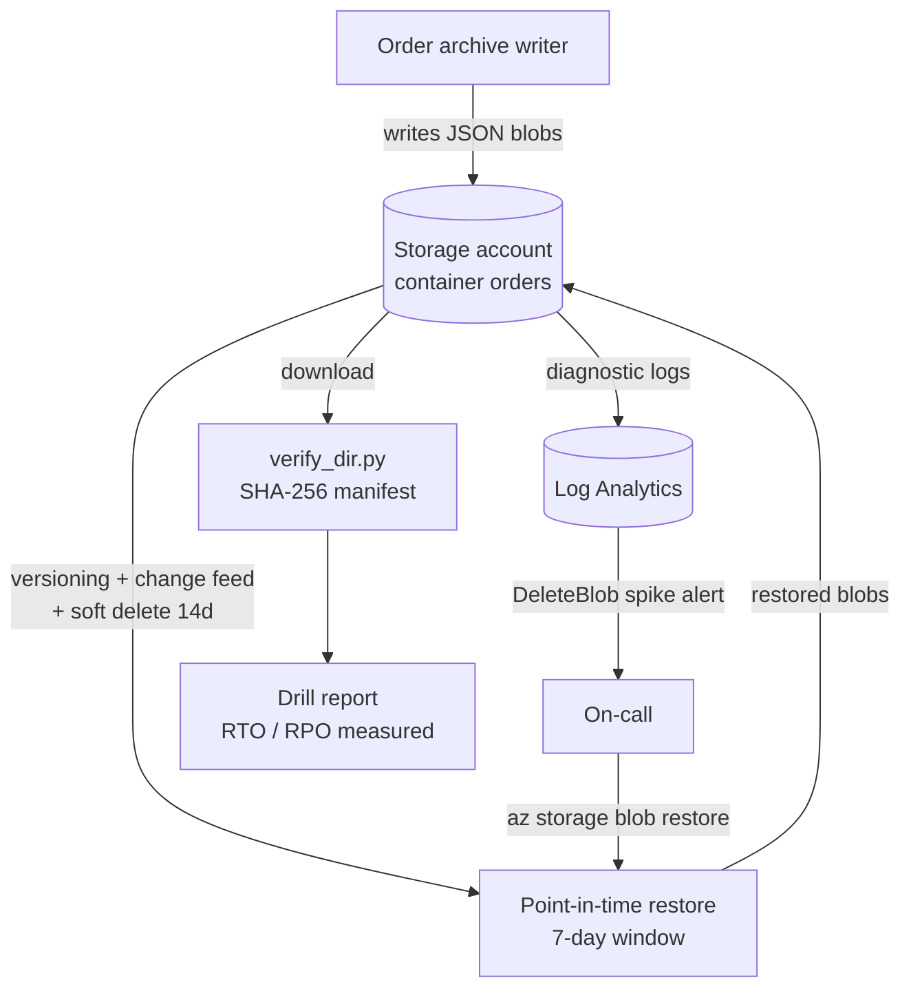

# Architecture: Azure Disaster Recovery and Restore Drill

```mermaid
flowchart TB
  app[Order archive writer] -->|writes JSON blobs| sa[(Storage account<br/>container orders)]
  sa -->|versioning + change feed<br/>+ soft delete 14d| pitr[Point-in-time restore<br/>7-day window]
  sa -->|diagnostic logs| law[(Log Analytics)]
  law -->|DeleteBlob spike alert| oncall[On-call]
  oncall -->|az storage blob restore| pitr
  pitr -->|restored blobs| sa
  sa -->|download| ver[verify_dir.py<br/>SHA-256 manifest]
  ver --> rep[Drill report<br/>RTO / RPO measured]
```
